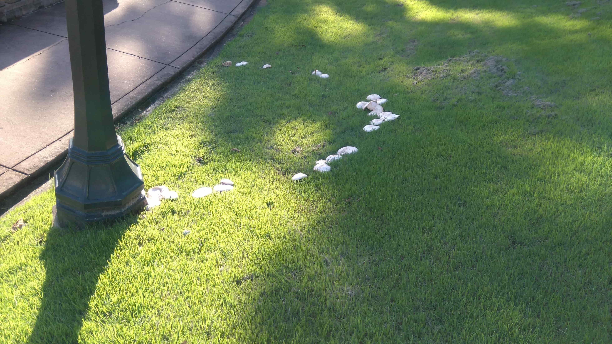

While I was taking a walk during late summer, I saw mushrooms arranges in almost a perfect circular pattern on grass. This is amazing if you think about it. The first time you see it, you might think someone planted them there in that pattern. How a natural phenomena arrange them in this pattern ?

Actually there are many folklore about the origins of these beauties. This is the reason we call them fairy rings. As we all might have heard fairies like to dance at night. They frequent grass plains or our own lawns at night and dance in circles. But they get tied like anyone of us would. But they did not have seats to sit on when they did. So they meet their fairy king and asks him for stools for them to sit on. So he granted their wish. The next night fairies were really happy to see mushrooms arranged in a circle in their favourite lawns. Now they can sit on them when tired. 

Well, this is a very convincing story isn’t it? Actually there are many types of mushrooms. Some of them are edible, some are unpalatable and some poisonous. When it comes to fairy rings, there are around 60 species of mushrooms which can produce them. Usually they can grow upto 30 feet diameter. They can be very old too. According to Wikipedia, the oldest one found is around 700 years old and was found in France. This was over 2000 feet large. 

A mushroom is a fungi, not a plant in that they haven’t got chlorophyll. They break down and extract nutrients from dead organic matter like dead plants and animals. Their living body of a mushroom is living underground. It is called mycelium and made out of thread-like small elements. They can be constrained to a small area or spread over several square miles. Since most of the parts of a mushroom fungi lives underground we might not see them. They live underground and absorb nutrients. When they are ready they may produce fruits which we call mushrooms. They are the mechanism to produce and spread spores through air. Spores are baby fungi that can establish themselves when they find fertile places to be. The mushroom produces spores in its gills and when the time comes they are puffed away into the air. 

When some of these spores find new ground, they start a new living body on the ground. They spread underground. And absorb nutrients around them. They may produce mushrooms while doing this. But after a while the nutrients in the vicinity become exhausted. So they have to move outwards where they can find more nutrients. So the mycelium moved outward. Now they are arranged in a ring-like pattern. When they produce mushrooms, they are arranged in a circular pattern. This is the was fairy rings are produced.

watch video: 

