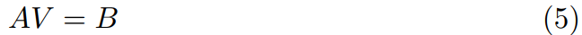
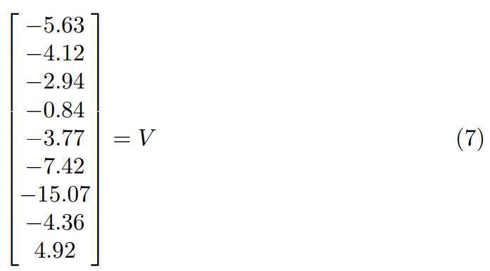

<center></center>
<center> Figure 1 </center>


In  the  grid-world  shown  in  the  Figure  1,  there  are  9  grids  in  the  world. The agent can be in any one of the squares. So the state of the agent is thenumber of grid it is in.  So,  define the state space 

*S={1,2,3,4,5,6,7,8,9}*

When the agent is in any grid number,  it can take any of the 4 actions 

*A={left,right,up,down}*

This tries to move the agent in the corresponding adjacent grid.

When the agent is behaving in its environment (this case, the grid world), it may use a certain policy.  A policy determines how the agent chooses its actions at a certain state. We usually denote a policy by *π*. One example is greedypolicy. If the agent behaves according to a greedy policy, it always chooses the ’apparently’ best action at each state. This makes sense at face value because we always want what is best.  But there is a catch.  When the agent chooses the best action, it is choosen based on the knowledge it has on the environment at the current moment. But if the agent’s knowledge of the environment is incomplete, it might choose a not-so-good action at certain states. But if the agent can learn from experience, it might choose some other action (not the apparently best action) just to see how it goes. By doing this it learns about its environment.  If the action choosen just now happens to be better than the action it previously thought the best one, the agent might chose to update its policy. This may make the agent better in behaving in the environment. Like thi, any agent can choose to take random actions from time to time just to see how it goes. This is called **exploring**. Exploring can reveal unknown knowledge about the environment dynamics. In contrast always choosing the actions the agent thinks the best ones with the knowledge (possibly incomplete) is called **exploitation** (becausethe agent exploits its current knowledge).

The agent may get scalar rewards. Therefor the reward space is a subset of real-values. Denote this as *R*. If the agent is in grid 9 and takes any action it goes to 1 and gets a reward of +10. If the agent is in grid 7 and takes any action, it goes to grid 1 and gets a reward of -10. If the agent hits a wall, it should get a punishment. This can also be modelled by reward. For example, if the agent is in state 2 and takes action *down*, it stays in state 2 and gets reward of -1. All other moves will give the agent a reward of 0.

In this grid-world all the transmissions are deterministic. That is if the agent is in state 2 and takes action *left* it goes to state 3 with a probability of 1.

Let's define transmission probabilities.

Some transmission probabilities at state 3 are as follows. 

The probability *P<sup>right</sup><sub>3,2</sub>* is the probability of going to state 2 when taking action *right* from state 3.

*P<sup>left</sup><sub>3,3</sub> = 1 , P<sup>right</sup><sub>3,2</sub> = 1 , P<sup>up</sup><sub>3,4</sub> = 1, P<sup>down</sup><sub>3,3</sub> = 1 , P<sup>left</sup><sub>3,4</sub> = 0*


All other probabilities are either 1 or 0 because this grid-world is a deterministic one.

Let's define rewards. Similar to the notation of the transmission probabilities, the reward *r<sup>right</sup><sub>5,6</sub>* is the reward the agent gets when it takes action *right* when at state 5 and transferring to state 6. Some rewards at state 6 are defined as below

*r<sup>left</sup><sub>6,5</sub> = 0 , r<sup>right</sup><sub>6,6</sub> = -1 , r<sup>up</sup><sub>6,7</sub> = 0 , r<sup>down</sup><sub>6,1</sub> = 0*

 Note that 
*r<sup>right</sup><sub>6,6</sub> = -1* 
because the agent gets -1 reward when it hits a wall and when this happens it stays in the previous state.

*r<sup>any</sup><sub>9,1</sub> = 10 , r<sup>any</sup><sub>7,1</sub> = -10*

Here *any* means any of the 4 actions can come here. This is because when the agent is either in state 9 or 7 and if it takes any action, it goes to state 1 and gets a reward of either 10 or -10.

Other rewards are defined accordingly.

The value of a state is defined by the state-value function. The value of state *s* can be written as


This is called the Bellman Equation.

Here *&gamma;* is called the discount factor. This determines how important the future rewards are with respect to more immediate rewards. usually, *&gamma; &isin; [0,1]*. If *&gamma; = 0*, this means that we are concerned only about the immediate reward. If *&gamma; = 1*, this means that future rewards are as important as the immediate reward. 
*s'* is any possible next action. 
&pi; is the policy the agent is following.
Now assume the agent here is following a random policy. That is it takes a random action at each state. So,


Also,

 are defined as above.
Now we are interested in finding the state values of each state, just to see.
To do that, lets substitute different states to the above Bellman equation.


Now we can form these equations into a matrix equation


We can find state values by solving the following equation



*V* gives us the state values. To find *V*, take


use *&gamma; = 0.9*. We can get



Figure 2 is a plot of these values on the grid world with a bar plot visualization. Note that I have added +16 to all the values of V for ease of visualization. 

<center></center>

<center>Figure 2</center>

We can see from Figure 2 that state 9 has the highest values and 7 the lowest. State 4 has the second highest values since there is a high probability to get to state 9 from 4. This is also true for state 8. But unfortunately it is equally likely to fall into state 7 from 8 too. So, its value is lower than that of 4. We can see that the state values gradually increase as we go closer to state 9. The values fall as we go closer to state 7.

But the policy we used here is a fixed one (randomly move around). This example does not tell the agent how to improve its behaviour. But what are the values of each state for the given policy. It is better if the agent has a way to learn better policies too. Moreover, this methods required us to know several things beforehand. We should know transmission probabilities, rewards and the policy implemented beforehand.

python code for solving the matrix equation and plotting the data are shown below

```python

from mpl_toolkits.mplot3d import Axes3D
import matplotlib.pyplot as plt
import numpy as np
from numpy.linalg import inv

#define our data 
A = np.array([[-0.55, 0.225, 0 , 0 , 0 , 0.225 , 0 , 0 , 0], [0.255, -0.775 , 0.225 , 0 , 0.225 , 0 , 0 , 0 , 0] , [0, 0.225, -0.55 , 0.225 , 0 , 0 , 0 , 0 , 0] , [0, 0 , 0.225 , -0.775 , 0.225 , 0 , 0 , 0 , 0.225] , [0, 0.225, 0 , 0.225 , -1 , 0.225 , 0 , 0.225 , 0] , [0.225, 0 , 0 , 0 , 0.225 , -0.775 , 0.225 , 0 , 0] , [0.9, 0, 0 , 0 , 0 , 0 , -1 , 0 , 0] , [0, 0, 0 , 0 , 0.225 , 0 , 0.225 , -0.775 , 0.225] , [0.9, 0 , 0 , 0 , 0 , 0 , 0 , 0 , -1]])
B = np.array([[0.5,0.25,0.5,0.25,0,0.25,10,0.25,-10]]).transpose()
#get insverse of matrix and multiplication
V = np.matmul(inv(A) , B)

#plot
fig = plt.figure()
ax1 = fig.add_subplot(111, projection='3d')

xpos = [1,1,1,2,2,2,3,3,3]
ypos = [1,2,3,1,2,3,1,2,3]
num_elements = len(xpos)
zpos = [0,0,0,0,0,0,0,0,0]
dx = np.ones(9) * 0.5
dy = np.ones(9) * 0.5
#I have manually entered the values from V here since indices are different
dz = np.array([-2.9,-0.8,4.9,-4.1,-3.7,-4.3,-5.6,-7.4,-15.1]) + 16
ax1.bar3d(xpos, ypos, zpos, dx, dy, dz, color='#00ceaa')
ax1.set_xticklabels('')
ax1.set_yticklabels('')

plt.show()

```


